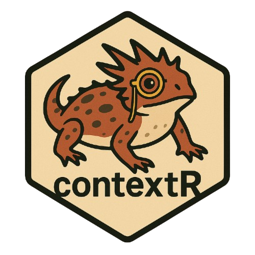

# contextR <a href="https://lazasaurus-ai.github.io/contextR"></a>

Light‑weight **conversational memory** for R, inspired by LangChain but 100 % native.\
Easily store, trim, persist, and format chat history for any LLM workflow.\
Includes out‑of‑the‑box helpers for **AWS Bedrock** via the [`ellmer`](https://github.com/tidyverse/ellmer) package.


`contextR` **solves two big challenges with LLMs in R:**

**1. Conversational context**  
Before, R had no way to keep track of what was said earlier in a conversation.  
For example, if you asked *“Tell me about frogs in the USA”* and then followed up with *“What about Mexico?”*, the LLM wouldn’t connect the dots.  
With **contextR**, the memory buffer keeps that thread of conversation intact.  

**2. Portable memory**  
The buffer can also be saved and reused — like a **USB stick for AI**.  
You can plug it into another LLM or AI agent workflow and instantly carry over all the context that’s already been built up.  


------------------------------------------------------------------------

## Installation

``` r
install.packages("devtools")
devtools::install_github("lazasaurus-ai/contextR")
```

### Dependencies

| Type     | Package              | Purpose                        |
|----------|----------------------|--------------------------------|
| Imports  | `tibble`, `glue`     | tidy tables & string glue      |
| Suggests | `ellmer`             | Bedrock chat helper (optional) |
| Suggests | `shiny`              | only for the demo Shiny app    |
| Suggests | `promises`, `future` | async Shiny example            |

------------------------------------------------------------------------

## Configure a default client via `.Rprofile`

Add this snippet to `~/.Rprofile` (or the project `.Rprofile`) so every R session automatically uses your preferred Bedrock model:

``` r
options(
  contextR.chat_client = ellmer::chat_aws_bedrock(
    model         = "anthropic.claude-3-5-sonnet-20240620-v1:0",
    system_prompt = "Answer concisely and use prior context."
  )
)
```

Now calls like `context_chat_client()` or the Shiny demo will pick up that client without additional code.

## Quick start (one‑shot helper)

``` r
library(contextR)

buf <- memory_buffer(
  k = 6,
  system_prompt = "Answer concisely and use prior context."
)

if (requireNamespace("ellmer", quietly = TRUE)) {

  # Turn 1
  chat_with_memory_one_shot(
    buffer   = buf,
    user_msg = "Tell me about frogs or toads in the USA?",
    followup = "Answer in 2–3 sentences."
  )

  # Turn 2 – context automatically included
  chat_with_memory_one_shot(
    buffer   = buf,
    user_msg = "What about Mexico?",
    followup = "Focus on differences vs USA."
  )

  get_memory(buf)
}
```

------------------------------------------------------------------------

## Supported Buffer-Memory Options

| Mode | How it works | Best for |
|-----------------|--------------------------------|-----------------------|
| **Fixed-size buffer** <br>`context_chat_client(k = …, summary_n = NULL)` | Retains only the *last **k*** user/assistant turns. When a new turn arrives and the cap is exceeded, the **oldest** row is discarded. | Very short chats or quick, interactive sessions where full detail isn’t required. |
| **Rolling-summary buffer** <br>`context_chat_client(k = …, summary_n = n)` | After every *n* raw turns (user + assistant) the client appends a concise **system summary** row. Older raw turns may be trimmed, but the latest summary row(s) preserve context, keeping the prompt small while the model still “remembers” earlier discussion. | Longer conversations that need continuity **without** the token cost of full transcripts. |

> **Tip:** keep `summary_n ≤ k − 1` so at least one summary row always fits inside the buffer.

### Fixed-size buffer

Simple rotation of context based on `k` number of rotations of user and assistance chats.

``` r
library(contextR)

cli <- context_chat_client(k = 6)  # Bedrock client + internal buffer

cli$chat("Tell me about frogs or toads in the USA.",
         followup = "Answer in 2–3 sentences.")
cli$chat("What about Mexico?")

cli$get_turns()      # tibble of all turns
#> # A tibble: 4 × 5
#>  role      content                                                                      timestamp           name  meta  
#>  <chr>     <chr>                                                                        <dttm>              <chr> <list>
#> 1 user      Tell me about frogs or toads in the USA.                                     2025-08-25 00:24:04 NA    <list>
#> 2 assistant The United States is home to a diverse array of frog and toad species, with… 2025-08-25 00:24:06 NA    <list>
#> 3 user      What about Mexico?                                                           2025-08-25 00:24:06 NA    <list>
#> 4 assistant Mexico has an even greater diversity of frogs and toads, with over 370 spec… 2025-08-25 00:24:09 NA    <list>
```

#### Simple Diagram

``` r
Fixed-size buffer  (k = 6, summary_n = NULL)
────────────────────────────────────────────────────────────
Turn # :  1   2   3   4   5   6   7   8   9 …
Buffer : [U] [A] [U] [A] [U] [A]            → oldest rows drop
                      ←─ last 6 rows kept ──┘

Legend U = user A = assistant  
Always keeps the most-recent 6 raw turns—nothing else.
```

### Rolling-summary chat client

Keep the buffer lean by rotating out the oldest messages once k rows are reached while injecting a concise system summary every n raw turns to retain the full conversation context.

``` r
library(contextR)

# Summarise every 4 raw turns, keep at most 6 rows total
cli <- context_chat_client(
  k          = 6,          # buffer size (rows)
  summary_n  = 4           # ↪ generate a system-summary after 4 raw turns
)

cli$chat("Tell me about frogs or toads in the USA.",
         followup = "Answer in 2–3 sentences.")
cli$chat("What about Mexico? Focus on differences vs USA.")
cli$chat("List three endangered amphibian species in Mexico.")
cli$chat("Briefly explain why amphibians are declining worldwide.")  # ← Summary 1 added
cli$chat("What can we do to help conserve these populations?")       # uses Summary 1

cli$get_turns()
#> # A tibble: 6 × 5
#>   role      content                               timestamp            name   meta
#> 1 assistant "Mexico has greater frog diversity…"  …                    NA     …
#> 2 user      "List three endangered species…"      …                    NA     …
#> 3 assistant "Three endangered amphibian species…" …                    NA     …
#> 4 user      "Briefly explain why amphibians…"      …                    NA     …
#> 5 assistant "Amphibians are declining worldwide…"  …                    NA     …
#> 6 system    "SUMMARY: Tell me about frogs… | … "   …          summary  <list>

The client automatically trims old rows to stay under `k`, but the **system summary** row
retains key facts, so the LLM still answers with full context while the prompt stays small.
```

#### Diagram

``` r
Rolling-summary buffer  (k = 6, summary_n = 4)
────────────────────────────────────────────────────────────
Turn # :  1   2   3   4   5   6   7   8   9  10  11  12 …
Buffer : [U] [A] [U] [A] [S] [U] [A] [U] [A] [S] …          →
                      └─ Summary 1 ─┘      └─ Summary 2 ─┘

Legend U = user A = assistant S = system summary  
After every 4 raw turns a concise **S** row is added.  
Old raw turns may be trimmed, but the newest summary row(s) preserve context,  
so the model still “remembers” earlier discussion while the buffer never
exceeds `k` rows.

Tip  Keep `summary_n ≤ k − 1` to guarantee at least one summary row fits.
```

------------------------------------------------------------------------

## Automatic persistence

The `load_or_new_memory()` allows you to easily create OR load previously existing `.rds` files where your buffer memory lives.

``` r
library(contextR)

buf <- load_or_new_memory(          # loads if file exists, else creates new
  k             = 6,
  system_prompt = "Answer concisely and use prior context.",
  save_dir      = "demo",
  save_file     = "frog_convo.rds"
)

if (requireNamespace("ellmer", quietly = TRUE)) {
  chat_with_memory_one_shot(buf, "Tell me about frogs in the USA.")
}

## later / next session ----

buf <- load_or_new_memory(
  save_dir  = "demo",
  save_file = "frog_convo.rds"
)
```

------------------------------------------------------------------------

## Breakdown of Prompt Memory

```r
> #library(contextR)
> 
> # ── 1. Create client with rolling summaries every 4 raw turns ──────────
> cli <- context_chat_client(k = 6, summary_n = 4)
Using model =
"anthropic.claude-3-5-sonnet-20240620-v1:0".
> 
> # ── 2. Four turns → Summary 1 is auto-appended ─────────────────────────
> cli$chat("Tell me about frogs or toads in the USA.",
+          followup = "Answer in 2–3 sentences.")
[1] "The United States is home to a diverse array of frogs and toads, with over 90 native species. These amphibians can be found in various habitats across the country, from wetlands and forests to deserts and mountains. Some well-known examples include the American bullfrog, spring peeper, and Western toad, each playing important roles in their respective ecosystems."
> cli$chat("What about Mexico? Focus on differences vs USA.")
[1] "Mexico has a higher diversity of frogs and toads, with over 370 species compared to the USA's 90+. Many Mexican species are endemic, found nowhere else in the world. Mexico's tropical and subtropical climates support unique amphibians like the axolotl and various tree frogs, which are less common in the USA's more temperate regions. Additionally, Mexico faces greater conservation challenges due to habitat loss and climate change impacts on its diverse amphibian populations."
> cli$chat("List three endangered amphibian species in Mexico.")
[1] "Three endangered amphibian species in Mexico are:\n\n1. Axolotl (Ambystoma mexicanum)\n2. Craugastor uno (One-toed Robber Frog)\n3. Plectrohyla pentheter (Perote Mountain Frog)\n\nThese species face threats from habitat loss, pollution, and climate change, highlighting Mexico's unique conservation challenges for its diverse amphibian population."
> cli$chat("Briefly explain why amphibians are declining worldwide.")  # ← Summary 1 created
[1] "Amphibians are declining worldwide due to several interrelated factors:\n\n1. Habitat destruction: Urbanization, deforestation, and agricultural expansion are destroying crucial amphibian habitats.\n2. Climate change: Altering temperatures and precipitation patterns disrupt breeding cycles and habitats.\n3. Pollution: Water and air pollution affect amphibians' sensitive skin and aquatic environments.\n4. Disease: The spread of pathogens like chytrid fungus is decimating many amphibian populations.\n5. Invasive species: Non-native predators and competitors are threatening native amphibian species.\n\nThese factors, often acting in combination, are causing widespread amphibian declines and extinctions globally."
> 
> # Inspect buffer: note the single system row named "summary"
> cli$get_turns()
# A tibble: 6 × 5
  role      content              timestamp           name  meta        
  <chr>     <chr>                <dttm>              <chr> <list>      
1 assistant "Mexico has a highe… 2025-08-25 13:05:33 NA    <list [0]>  
2 system    "SUMMARY (fallback)… 2025-08-25 13:05:33 summ… <named list>
3 user      "List three endange… 2025-08-25 13:05:33 NA    <list [0]>  
4 assistant "Three endangered a… 2025-08-25 13:05:36 NA    <list [0]>  
5 user      "Briefly explain wh… 2025-08-25 13:05:36 NA    <list [0]>  
6 assistant "Amphibians are dec… 2025-08-25 13:05:40 NA    <list [0]>  
> #> # A tibble: 6 × 5
> #>   role      content                          timestamp            name   meta
> #> 1 assistant “… USA answer …”                2025-08-24 …         NA     …
> #> 2 system    "SUMMARY: Tell me about …"      2025-08-24 …         summary <…>
> #> 3 user      "List three endangered …"       2025-08-24 …         NA     …
> #> 4 assistant "Three endangered amphibian …"  2025-08-24 …         NA     …
> #> 5 user      "Briefly explain why …"         2025-08-24 …         NA     …
> #> 6 assistant "Amphibians are declining …"    2025-08-24 …         NA     …
> 
> # ── 3. Show exactly what will be sent to the LLM next ──────────────────
> prompt_preview <- memory_prompt(
+   cli$memory(),                                        # buffer with summary row
+   "Given our discussion, name one frog species unique to Mexico and explain why it is endemic.",
+   format = "ellmer"
+ )
> cat(prompt_preview)
### System
Answer concisely and use prior context.

### Conversation History

- assistant: Mexico has a higher diversity of frogs and toads, with over 370 species compared to the USA's 90+. Many Mexican species are endemic, found nowhere else in the world. Mexico's tropical and subtropical climates support unique amphibians like the axolotl and various tree frogs, which are less common in the USA's more temperate regions. Additionally, Mexico faces greater conservation challenges due to habitat loss and climate change impacts on its diverse amphibian populations.
- system: SUMMARY (fallback): Tell me about frogs or toads in the USA. | The United States is home to a diverse array of frogs and toads, with over 90 native species. These amphibians can be found in various habitats across the country, from wetlands and forests to deserts and mountains. Some well-known examples include the American bullfrog, spring peeper, and Western toad, each playing important roles in their respective ecosystems. | What about Mexico? Focus on differences vs USA. | Mexico has a higher diversity of frogs and toads, with over 370 species compared to the USA's 90+. Many Mexican species are endemic, found nowhere else in the world. Mexico's tropical and subtropical climates support unique amphibians like the axolotl and various tree frogs, which are less common in the USA's more temperate regions. Additionally, Mexico faces greater conservation challenges due to habitat loss and climate change impacts on its diverse amphibian populations.
- user: List three endangered amphibian species in Mexico.
- assistant: Three endangered amphibian species in Mexico are:

1. Axolotl (Ambystoma mexicanum)
2. Craugastor uno (One-toed Robber Frog)
3. Plectrohyla pentheter (Perote Mountain Frog)

These species face threats from habitat loss, pollution, and climate change, highlighting Mexico's unique conservation challenges for its diverse amphibian population.
- user: Briefly explain why amphibians are declining worldwide.
- assistant: Amphibians are declining worldwide due to several interrelated factors:

1. Habitat destruction: Urbanization, deforestation, and agricultural expansion are destroying crucial amphibian habitats.
2. Climate change: Altering temperatures and precipitation patterns disrupt breeding cycles and habitats.
3. Pollution: Water and air pollution affect amphibians' sensitive skin and aquatic environments.
4. Disease: The spread of pathogens like chytrid fungus is decimating many amphibian populations.
5. Invasive species: Non-native predators and competitors are threatening native amphibian species.

These factors, often acting in combination, are causing widespread amphibian declines and extinctions globally.

### New User Prompt
Given our discussion, name one frog species unique to Mexico and explain why it is endemic.
```

------------------------------------------------------------------------

## Shiny demo

Launch:

``` r
shiny::runApp(
  system.file("demo", "shiny_example.R", package = "contextR")
)
```

------------------------------------------------------------------------

## CRAN notes

-   All network calls are protected with `requireNamespace("ellmer", quietly = TRUE)`.
-   Network examples are wrapped in `\dontrun{}`.
-   Demo scripts are ignored by `.Rbuildignore`.

------------------------------------------------------------------------

## License

MIT © 2025 Lazaro Alvarez
